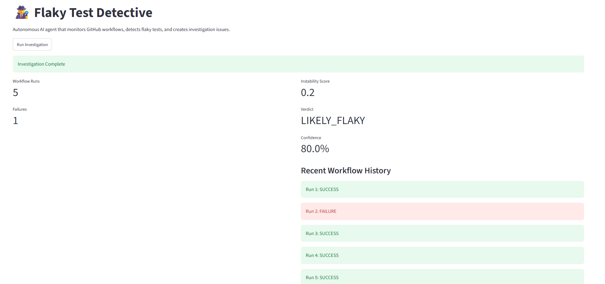
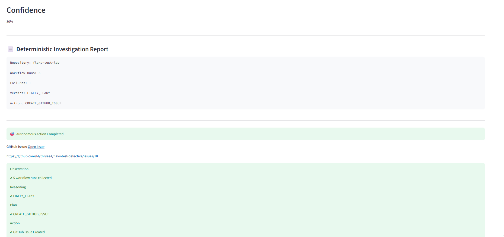
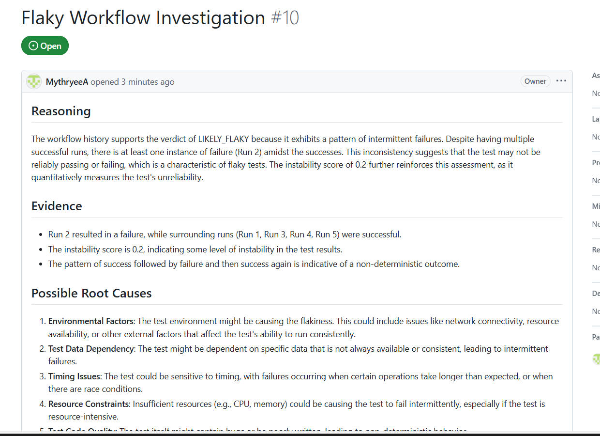

# 🎥 Demo Video

👉 **Watch the Demo Video:**  
[Flaky Test Detective Demo](https://drive.google.com/file/d/12Bv6dcycI-yo5DAxwC2FRNn0NtHrBlrH/view?usp=sharing).

# 🕵️ Flaky Test Detective

# An autonomous AI engineering agent that observes GitHub CI workflows, reasons about flaky test behavior, plans corrective actions, and automatically creates investigation issues for developers.

Built for the **Kartiline AI Agent Hackathon 2026**
# Idea #052 – Flaky Test Detective

# The Problem

Modern software teams rely heavily on Continuous Integration (CI) pipelines to validate every code change. Unfortunately, many teams encounter **flaky tests**—tests that randomly pass or fail despite no changes to the underlying code.

These intermittent failures create uncertainty:

* Developers rerun workflows instead of fixing code.
* Engineers waste time inspecting logs.
* Release pipelines become slower.
* Teams gradually lose trust in automated testing.

The challenge is not simply detecting failures—it is determining **whether a failure is a genuine regression or merely an unstable test.**

# Our Solution

Flaky Test Detective is an **autonomous AI engineering assistant** that continuously investigates CI workflows.

Rather than waiting for engineers to inspect failures manually, the agent:

* Observes GitHub workflow executions
* Detects flaky behavior from workflow history
* Reasons about instability using deterministic logic and an LLM
* Plans the appropriate engineering action
* Automatically creates GitHub Issues containing investigation reports

The engineer remains in control while repetitive investigation work is automated.

# Agent Lifecycle

The agent follows a complete autonomous decision loop.

```
Observe
    ↓
Reason
    ↓
Plan
    ↓
Act
```

## 🔍 Observe

The agent continuously gathers evidence from GitHub.

It collects:

* Workflow history
* Pass/fail outcomes
* Repository metadata
* Execution patterns

## 🧠 Reason

The agent combines:

* Deterministic flakiness scoring
* Pattern analysis
* LLM-based engineering reasoning

It determines whether the observed behavior is likely caused by flaky tests.

## 📋 Plan

After reasoning, the agent decides the appropriate engineering action.

Examples:

* Monitor further
* Investigate
* Create GitHub Issue

## ⚡ Act

The agent automatically:

* Generates an investigation report
* Produces an engineering summary
* Creates a GitHub Issue
* Recommends the next debugging steps

# Features

* GitHub workflow monitoring
* Flakiness detection engine
* Instability score calculation
* Confidence estimation
* AI-generated investigation summary
* Root cause suggestions
* Automated GitHub Issue creation
* Interactive Streamlit dashboard
* Observe → Reason → Plan → Act visualization

# Tech Stack

* Python
* Streamlit
* GitHub REST API
* GitHub Actions
* PyGithub
* Groq LLM
* Markdown Reports

# Repository Structure

```
detector/
    github_workflow_reader.py
    github_log_reader.py
    flakiness_decision_engine.py
    github_issue_creator.py
    root_cause_analyzer.py

sample_logs/
reports/

app.py
agent.py
run_agent.py
```

# Running the Project

Clone the repository.

```
git clone <repo-url>
```

Install dependencies.

```
pip install -r requirements.txt
```

Configure your environment variables.

```
GITHUB_TOKEN=...
GROQ_API_KEY=...
```

Run the Streamlit dashboard.

```
streamlit run app.py
```

Or execute the autonomous agent directly.

```
python run_agent.py
```

# Demo

The Streamlit dashboard demonstrates the complete autonomous investigation workflow.

During execution the agent:

1. Observes GitHub workflow runs
2. Reasons about flaky behavior
3. Plans the engineering response
4. Creates a GitHub Issue automatically

# Future Work

Future versions will include:

* Automatic Pull Request generation
* Test quarantine workflows
* Git bisect integration
* Multi-repository monitoring
* Historical analytics dashboard
* Slack and Microsoft Teams notifications

# Why This Is Agentic

Unlike rule-based automation, Flaky Test Detective performs a complete autonomous decision cycle.

It:

* Perceives engineering context from GitHub
* Reasons about workflow instability
* Plans the appropriate engineering response
* Takes action by creating investigation issues

The human engineer remains in control while repetitive investigative work is delegated to the AI agent.

# Hackathon

**Kartiline AI Agent Hackathon 2026**

**Idea #052 — Flaky Test Detective**
## Demo Screenshots

### Dashboard



### AI Investigation



### GitHub Issue Created by the Agent



